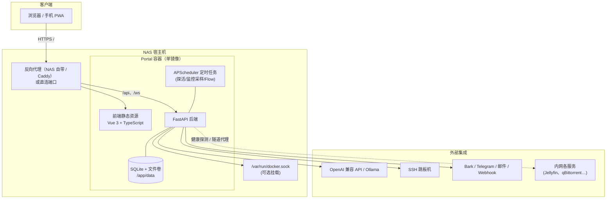
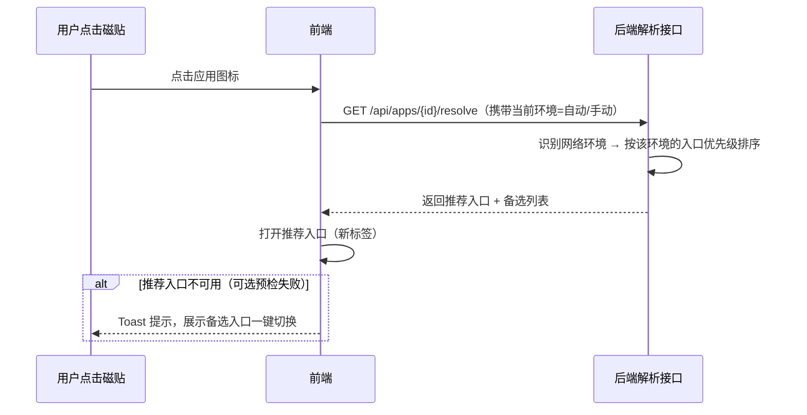

# Portal — NAS 门户系统设计方案

> **版本**：v0.5 ｜ **日期**：2026-09-01 ｜ **状态**：开发中
>
> **v0.5 变更**：UI 设计系统升级为**亮色现代风 v2**（浅色底 + 白色卡片 + 渐变主按钮 + 入场/悬停/路由过渡动效）；登录页移动端专项优化；路由改静态导入消除跳转空窗。
>
> **v0.4 变更**：§9 新增**传输加密方案**——TLS 基线 + 应用层端到端加密（RSA-3072 密钥交换 + AES-256-GCM 信封），HTTP 下数据不明文传输；协议细节见 api-spec §7。
>
> **v0.3 变更**：§6 新增 **移动端 UI 方案**（选型对比与实现规范：响应式 + 底部 Tab + 安全区适配，登录页与仪表盘外壳已完成落地）。
>
> **v0.2 变更**：① 数据模型补全 14 张新表（监控告警/端口/同步/凭据等），字段级定义见《接口详述 api-spec》v1.0；② 存储策略定稿：SQLite 运行主库 + 定时镜像推送 NAS MySQL；③ API 章节指向 api-spec 并补充新端点；④ §11 待确认问题闭环为决策表，不阻塞开发。
>
> 一句话定位：部署在 NAS 上的**自托管门户（Dashboard）**——统一登录、统一入口、智能识别网络环境、内置 AI 助手与 Flow 自动化。

---

## 1. 项目概述

### 1.1 背景与目标

NAS 上跑的服务越来越多（影音、下载、网盘、Docker 应用、管理后台……），痛点：

- 每个服务地址、端口各不相同，记忆成本高；
- **同一服务在不同网络环境下访问方式不同**：家里用内网 IP 直连最快， outside 走域名/公网，公司网络可能只能通过 SSH 跳板机隧道访问；
- 缺少统一的登录入口与权限控制，服务直接暴露在局域网/公网不安全；
- 缺少统一的状态监控与自动化能力。

**目标**：做一个单 Docker 容器部署的门户系统，作为所有服务的"第一入口"：

1. 登录后进入首页，看到可点击的**应用 Icon 磁贴**；
2. 每个应用可配置**多种访问方式**（域名 / 内网 IP / SSH 隧道 / VPN…），系统**自动识别当前网络环境并推荐最佳入口**；
3. 提供 AI 助手、Flow 自动化、监控、通知等增强能力。

### 1.2 核心亮点（差异化）

| 亮点 | 说明 |
|---|---|
| 🌐 **多访问方式智能解析** ★ | 每个应用挂多个入口，按"网络环境档案"自动推荐最佳入口，点击即达 |
| 🤖 **AI 助手** | OpenAI 兼容 API / 本地 Ollama，支持意图导航（"帮我打开电影服务器"） |
| ⚙️ **Flow 自动化** | 触发器 + 条件 + 动作的轻量编排（定时/Webhook/事件 → 通知/HTTP/SSH/Docker 操作） |
| 📊 **状态监控** | 应用在线探活 + NAS 资源监控，首页图标带在线状态点 |
| 🐳 **单容器部署** | 前后端打包为一个镜像，一条 `docker-compose` 在 NAS 上跑起来 |

### 1.3 对标产品

Heimdall、Homarr、Dashy、Sun-Panel、homepage——以上均为优秀开源自托管面板，但**多网络环境智能解析、AI 意图导航、Flow 自动化**是本项目的差异化重点。

---

## 2. 总体架构

### 2.1 架构图



**部署形态**：前后端打包进**同一个镜像**。FastAPI 既提供 `/api` 接口，也通过 `StaticFiles` 托管前端构建产物，无需额外的 Nginx 容器，NAS 上部署最简单。外层可按需套 NAS 自带反代做 HTTPS 与域名。

### 2.2 技术选型

| 层 | 选型 | 说明 |
|---|---|---|
| 前端框架 | **Vue 3 + TypeScript + Vite** | 按要求；`<script setup>` 组合式 API |
| 状态/路由 | Pinia + Vue Router | |
| UI 组件库 | **Element Plus**（备选 Naive UI） | 生态成熟、中文文档全、表格/表单组件丰富 |
| 图表 | ECharts | 监控页 CPU/内存/网络曲线 |
| 拖拽 | vuedraggable（vue-draggable-plus） | 首页磁贴与分组排序 |
| 流程画布（后期） | Vue Flow | Flow 可视化编排 |
| 后端框架 | **Python 3.12 + FastAPI + Uvicorn** | 异步、自动 OpenAPI 文档 |
| ORM / 数据库 | SQLAlchemy 2.0 + **SQLite** 主库（aiosqlite），镜像推送 NAS **MySQL** | 运行读写全走 SQLite；MySQL 作灾备/集中存储（dev-plan P23） |
| 数据校验 | Pydantic v2 | 与 FastAPI 原生集成 |
| 认证 | JWT（access + refresh）+ bcrypt | 后续可加 TOTP 两步验证 |
| 定时任务 | APScheduler | 探活、监控采样、Flow cron 触发 |
| HTTP 客户端 | httpx（异步） | 健康探测、Webhook、AI API 调用 |
| SSH | asyncssh / paramiko | 跳板机隧道 |
| Docker（可选模块） | docker-py | 容器列表/启停（需挂载 sock） |
| 系统监控 | psutil + 宿主机 `/proc` 挂载 | CPU/内存/磁盘/网络 |
| 打包 | Docker 多阶段构建 | Node 构建 → Python 运行时 |

---

## 3. 功能模块设计

### 3.1 用户与认证

- **登录页**：用户名/密码 → 后端签发 JWT（access 30min + refresh 7d），前端 axios 拦截器自动续期。
- **首次初始化**：系统无用户时进入引导页，创建管理员账号。
- **角色**：`admin`（全部权限）/ `user`（只读首页 + 个人偏好）；支持开启"**访客模式**"（无需登录，只展示允许公开的应用）。
- **安全策略**：密码 bcrypt 哈希；登录失败限速（5 次/分钟锁定 IP）；可选 **TOTP 两步验证**（Phase 2）。
- **企业方向预留（Phase 3）**：OIDC / LDAP 单点登录，方便公司内使用。

### 3.2 首页仪表盘

登录后的默认页，主打"高定制、好看、好用"：

- **应用磁贴**：Icon + 名称 + 描述 + 在线状态点；支持**拖拽排序**、调整大小（1x/2x 卡片）。
- **分组/分类**：横向分组区块（如"媒体"、"下载"、"工具"、"管理"），分组可折叠。
- **全局搜索**：顶栏搜索框，按名称/描述/标签过滤应用，回车直达；支持自定义快捷搜索（如 `gh xxx` → GitHub 搜索）。
- **小组件（Widget，可开关/排序）**：
  - 时钟 + 问候语 + 农历/节日（可选）
  - 天气（对接免费 API，按 IP 定位）
  - NAS 资源速览（CPU/内存/磁盘环形图）
  - 最近通知、Flow 最近执行
- **外观**：亮/暗主题、主题色、自定义壁纸（上传）、磁贴 Icon 支持图片 URL / 本地上传 / Emoji / 自动抓取目标站 favicon。
- **多入口跳转交互**：单入口直接跳；多入口按当前环境自动选择（详见 3.4），可配置"点击弹出选择浮层"。

### 3.3 应用与分类管理

管理页对应用/分组做 CRUD：

| 字段 | 说明 |
|---|---|
| 名称 / 描述 / 分组 / 排序 | 基础信息 |
| 图标 | URL / 上传 / Emoji / 自动 favicon |
| **访问入口（1..N）** | 见 3.4，每个应用的核心配置 |
| 探活地址 | 可选，用于状态点与离线告警（HTTP 或 TCP 形式） |
| 打开方式 | 新标签页 / 当前页 / 内嵌 iframe 窗口 |
| 可见性 | 所有人可见 / 仅管理员 / 仅指定用户 |
| 标签 | 自由标签，配合搜索 |

批量操作：导入/导出（JSON，兼容常见书签格式）、批量移动分组。

### 3.4 多访问方式管理 ★ 核心模块

解决"**同一个服务，不同网络环境用不同地址访问**"的问题。

#### 3.4.1 概念模型

```
应用 App（例：Jellyfin）
 └── 访问入口 AppUrl × N
      ├── type: domain  →  https://jellyfin.mydomain.com   （公网/域名，走反代）
      ├── type: lan     →  http://192.168.1.10:8096        （家庭内网直连）
      ├── type: ssh     →  /tunnel/{id} 经跳板机的隧道代理   （公司网络）
      ├── type: vpn     →  http://10.8.0.1:8096            （VPN 网段）
      └── type: custom  →  任意自定义地址
 每个入口可设置：名称标签、排序、备注
```

#### 3.4.2 网络环境档案（Network Profile）

设置页中定义若干"环境档案"，系统自动识别当前请求处于哪个环境：

| 环境示例 | 识别方式（CIDR 匹配客户端 IP） | 入口优先顺序 |
|---|---|---|
| 家庭内网 | `192.168.1.0/24` | lan → domain → vpn |
| 公司网络 | `10.12.0.0/16` | ssh → domain |
| VPN 接入 | `10.8.0.0/24` | vpn → domain |
| 外网/其他 | 兜底默认档案 | domain |

- 识别策略：**自动（CIDR）+ 手动覆盖**。后端按请求来源 IP 匹配档案；前端顶栏显示当前环境徽标，用户可手动切换（记住选择）。
- 未配置任何档案时退化为普通面板（直接用第一个入口）。

#### 3.4.3 智能解析流程



- 可选"点击前预检"：后端快速 TCP/HTTP 探测推荐入口（500ms 超时），不通则直接给备选。
- 解析结果缓存于前端，配合 WebSocket 在环境/探活状态变化时刷新。

#### 3.4.4 SSH 隧道访问（公司场景）

分两阶段实现：

- **Phase 1（本地隧道，简单可靠）**：为 `ssh` 类型入口生成一条现成命令，如
  `ssh -L 18096:192.168.1.10:8096 user@jump.company.com`，点击时弹窗复制命令，并在本地打开 `http://localhost:18096`。
- **Phase 2（服务端托管隧道）**：后端用 asyncssh 维护隧道进程，门户提供 `/tunnel/{tunnel_id}/...` 反代路径，点击直接可用；空闲超时自动断开。跳板机密钥存于数据卷，支持密码/私钥两种认证。

#### 3.4.5 设置页面（访问方式管理中心）

独立页面 **"设置 → 访问方式"**，三块内容：

1. **网络环境档案管理**：增删改环境、配置 CIDR、拖拽调整各环境的入口优先顺序、"从当前 IP 快速创建档案"。
2. **应用入口批量配置**：表格视图列出所有应用 × 入口矩阵，快速补全地址。
3. **连通性测试**：一键对全部入口做探测，展示延迟矩阵（哪个环境下哪些入口通/不通），辅助配置。

### 3.5 AI 助手 🤖

- **接入方式**：OpenAI 兼容 API（可配 `base_url` + `api_key` + `model`），天然支持 DeepSeek、智谱、Kimi、通义等；也可指向 NAS 本地 **Ollama**（`http://nas:11434`）。Key 只存服务端，前端不经手。
- **交互形态**：全局侧边抽屉（任何页面可用）+ 独立全屏对话页；SSE 流式输出；多会话管理。
- **核心能力**：
  1. **意图导航**：System Prompt 注入当前用户可见的应用清单，AI 返回结构化动作 `{action: "navigate", app_id: 12}`，前端直接跳转——"帮我打开下载器"、"打开路由器管理"；
  2. **上下文感知（可开关）**：可注入 NAS 负载、运行中容器、当前网络环境等摘要，回答"NAS 现在卡不卡"这类问题；
  3. 通用问答/翻译/总结；
  4. 快捷指令（预设 Prompt 一键发送）；
  5. **辅助配置（Phase 2）**：粘贴一段服务信息，AI 自动生成应用条目（名称/图标建议/分类）；Flow 描述转配置（"每天 8 点检查下载并通知我" → 生成 Flow JSON 草稿，人工确认后保存）。
- **会话持久化**：`ai_conversations / ai_messages` 表，支持续聊、删除、导出。

### 3.6 Flow 自动化 ⚙️

轻量版 n8n/IFTTT：**触发器 → 条件 → 动作**，Phase 2 用表单式编排，Phase 3 升级 Vue Flow 画布（拖拽节点、连线、调试）。

| 类别 | 内置项 | 配置示例 |
|---|---|---|
| 触发器 | 定时 cron / Webhook / 手动 / 事件（应用离线、CPU 超阈值） | `0 8 * * *`；`POST /api/hooks/flow/{token}` |
| 条件 | 表达式判断（引用上游输出） | `prev.status_code == 200` |
| 动作 | HTTP 请求 / 通知推送 / SSH 执行命令 / Docker 容器操作 / 调用 AI / 延时 / 设置变量 | restart jellyfin；发 Bark |

**典型场景**：

- 每天 08:00 检查 qBittorrent 完成数 → 变化则 Bark 推送"昨夜新增下载 X 个"；
- 探活发现 Jellyfin 离线 → 自动 SSH/Docker 重启 → 仍失败则升级通知；
- Webhook（如手机快捷指令）触发 → AI 总结今日待办 → 推送到 Telegram。

**执行引擎**：APScheduler 注册 cron 触发器；Webhook/事件走内部总线；每次执行记录 `flow_runs`（状态、耗时、每步日志），失败自动通知。动作为异步顺序执行（Phase 3 画布支持分支并行）。

### 3.7 系统监控 📊

> v0.2 注：监控能力已按《功能详述》拆分为三层——**M07 应用探活与可用性 / M17 服务器性能监控★（最高优先级）/ M18 端口监控★**，本节为概览，明细以 feature-spec 为准。

- **应用探活**：APScheduler 定时探测（间隔可配，默认 60s；HTTP 状态码或 TCP 端口连通），结果落库并经 WebSocket 推送前端，磁贴右上角绿/红/灰点。
- **NAS 资源**：
  - 采集：容器内挂载宿主机只读 `/proc`、`/sys`（psutil 指向宿主数据源），读取 CPU/内存/磁盘/网络速率；Docker 场景兜底可用 `docker stats`；
  - 存储：每分钟采样写 `monitor_samples`，默认保留 7 天自动清理；
  - 展示：监控页 ECharts 折线图（实时 + 24h/7d 历史）；首页速览小组件。
- **Docker 容器管理（可选模块，Phase 2/3）**：容器列表、状态、CPU/内存占用，启/停/重启；需挂载 `docker.sock`，默认关闭并在文档说明安全权衡。
- **NAS 专属适配（Phase 3）**：群晖 DSM API / 威联通 API 对接（取决于你的 NAS 型号，见 §11 待确认）。

### 3.8 通知中心 🔔

- **渠道**：Bark（iOS）、Telegram Bot、钉钉/企业微信/飞书机器人、SMTP 邮件、通用 Webhook；渠道可配多个，发送测试按钮。
- **站内通知**：`notifications` 表 + 顶栏铃铛角标 + WebSocket 实时推送；级别分 info/warn/error。
- **来源**：探活状态变化、Flow 执行结果、系统事件（登录异常、备份完成）、AI 任务完成。

### 3.9 系统设置与通用能力

- **常规**：站点名称/Logo、默认语言（中/英 i18n）、注册开关、访客模式。
- **外观**：主题色、默认亮暗、壁纸管理。
- **访问方式**：网络环境档案（见 3.4.5）。
- **AI**：Provider 配置、默认模型、上下文注入开关。
- **通知**：渠道管理、通知免打扰时段。
- **安全**：修改密码、会话管理（踢出设备）、TOTP 开关、审计日志查看。
- **数据**：一键导出/导入（JSON 全量备份：应用、入口、环境、Flow、设置），图标文件随卷保留；危险区：恢复出厂。

---

## 4. 数据模型设计

**存储策略（v0.2）**：以 **SQLite 为运行主库**（`/app/data/portal.db`，零依赖、低延迟），通过定时任务把业务数据**镜像推送到 NAS 上的 MySQL** 作为灾备与集中存储；MySQL 不可达不影响本地运行。**字段级表结构（31 张表）的权威定义见《接口详述 api-spec》§3**，此处列核心表概览：

| 表 | 关键字段 | 说明 |
|---|---|---|
| `users` | id, username, password_hash, role, is_active, totp_secret, prefs(JSON), created_at | 用户 |
| `categories` | id, name, icon, sort | 应用分组 |
| `apps` | id, name, description, icon, icon_type, category_id, sort, enabled, health_url, open_mode, visibility, created_at | 应用 |
| `app_urls` ★ | id, app_id, **access_type**(domain/lan/ssh/vpn/custom), url, label, sort | 应用访问入口（一对多） |
| `network_profiles` ★ | id, name, match_type(cidr/manual), match_value, prefer_types(JSON), is_default | 网络环境档案 |
| `settings` | key(PK), value(JSON) | 站点键值配置 |
| `flows` | id, name, description, trigger_type, trigger_config(JSON), actions(JSON), enabled, last_run_at | 自动化流 |
| `flow_runs` | id, flow_id, status, trigger, started_at, finished_at, logs(TEXT) | 执行历史 |
| `monitor_samples` | id, ts, cpu, load, mem, disks, nets, io, temps, procs(JSON) | 服务器资源采样 |
| `app_status` | app_id, state, latency_ms, checked_at, message | 探活最新状态 |
| `notifications` | id, title, body, level, is_read, created_at | 站内通知 |
| `notify_channels` | id, type, name, config(JSON), enabled | 通知渠道 |
| `ai_conversations` / `ai_messages` | 会话与消息（role, content, tokens, created_at） | AI 会话 |
| `tunnels` ★ | id, app_url_id, local_port, status, pid, last_active_at | SSH 隧道（Phase 2） |
| `audit_logs` | id, user_id, action, detail, ip, created_at | 审计 |
| `user_sessions` | id, user_id, refresh_hash, device, ip, revoked | 会话管理（M2） |
| `probe_events` | id, app_id, event, latency_ms, created_at | 探活事件时间线 |
| `alert_rules` | id, metric, target, op, threshold, duration_min, level | 服务器指标阈值告警（M2） |
| `port_monitors` / `port_events` | host/port/state/latency；通断事件 | 端口监控（M2）★ |
| `port_listen_history` | ts, added, removed | 监听端口变更快照（M3） |
| `credentials` | id, name, type, host, port, username, secret(加密) | SSH 凭据库（M2） |
| `notify_rules` | id, event, channel_ids, quiet_start/end | 通知路由规则（M2） |
| `calendar_events` / `todos` | 日程/待办字段 | 日程与提醒（M2） |
| `wol_targets` / `short_links` | MAC 设备；短链 code→target | 工具箱 |
| `api_tokens` | id, name, token_hash, scope, expires_at | 开放 API（M2） |
| `sync_state` | id, table_name, last_push_at, rows_pushed, status | MySQL 同步状态（M2） |
| `dashboard_layouts` | id, user_id, tab, layout(JSON) | 首页多标签页布局（M1） |

---

## 5. API 设计

REST 风格，前缀 `/api`，JWT 鉴权（登录/钩子除外）；FastAPI 自动生成 `/docs` OpenAPI 文档。**统一响应格式、错误码表、实时推送协议与全量端点契约见《接口详述 api-spec》§1/§2/§4/§5**。核心端点概览：

| 分组 | 方法与路径 | 说明 |
|---|---|---|
| 认证 | `POST /api/auth/login` · `POST /api/auth/refresh` · `GET /api/auth/me` | 登录 / 续期 / 当前用户 |
| 分类 | `GET/POST /api/categories` · `PUT/DELETE /api/categories/{id}` | 分组 CRUD |
| 应用 | `GET/POST /api/apps` · `PUT/DELETE /api/apps/{id}` · `PUT /api/apps/sort` | 应用 CRUD / 批量排序 |
| 入口 ★ | `GET/POST /api/apps/{id}/urls` · `PUT/DELETE /api/app-urls/{id}` | 访问入口 CRUD |
| 解析 ★ | `GET /api/apps/{id}/resolve` | 按当前环境返回推荐入口 + 备选 |
| 环境 ★ | `GET/POST /api/network-profiles` · `PUT/DELETE .../{id}` · `POST /api/network-profiles/detect` | 环境档案 CRUD / 探测当前环境 |
| 探活 | `POST /api/apps/{id}/check` | 立即探测一次 |
| 隧道 ★ | `POST /api/tunnels/{url_id}/open` · `DELETE /api/tunnels/{id}` | 开/关 SSH 隧道（Phase 2） |
| 监控 | `GET /api/monitor/system` · `GET /api/monitor/history?range=24h` | 实时概览 / 历史曲线 |
| 告警 | `GET/POST /api/alerts/rules · PUT/DELETE .../{id}` | 阈值告警规则（M2） |
| 端口 ★ | `GET /api/ports/listen · CRUD /api/ports/monitors · GET /api/ports/lookup` | 端口监听/探活/占用检索（M2） |
| 同步 | `GET/PUT /api/settings/sync · POST /api/sync/push · POST /api/sync/restore` | MySQL 镜像同步（P23） |
| 工具 | `POST /api/tools/wol · /ping · GET /api/tools/qr …` | 工具箱 |
| Docker | `GET /api/docker/containers` · `POST /api/docker/containers/{name}/{op}` | 可选模块（op: start/stop/restart） |
| Flow | `GET/POST /api/flows` · `PUT/DELETE /api/flows/{id}` · `POST /api/flows/{id}/run` · `GET /api/flows/{id}/runs` | Flow CRUD / 手动执行 / 历史 |
| Webhook | `POST /api/hooks/flow/{token}` | Flow Webhook 触发入口 |
| AI | `POST /api/ai/chat`（SSE）· `GET/POST/DELETE /api/ai/conversations...` | 流式对话 / 会话管理 |
| 通知 | `GET /api/notifications` · `PUT /api/notifications/read-all` | 站内通知 |
| 渠道 | `GET/POST /api/notify-channels` · `POST .../{id}/test` | 渠道 CRUD / 测试发送 |
| 设置 | `GET/PUT /api/settings` | 键值配置 |
| 备份 | `GET /api/backup/export` · `POST /api/backup/import` | 导出/导入 |
| WebSocket | `/ws/monitor` · `/ws/notify` | 实时监控与通知推送 |

---

## 6. 前端设计

### 6.1 路由与页面

| 路由 | 页面 | 说明 |
|---|---|---|
| `/login` | 登录 / 首次初始化引导 | |
| `/` | **首页仪表盘** | 磁贴 + 分组 + 小组件 + 搜索 |
| `/apps` | 应用管理 | 列表 + 编辑抽屉 + 入口矩阵 |
| `/monitor` | 监控 | 系统资源图表 + 应用状态 + 容器（可选） |
| `/flows` · `/flows/:id/edit` | Flow 列表 / 编排（表单→画布） | |
| `/ai` | AI 对话（全屏） | 侧边抽屉为全局组件 |
| `/settings/access` ★ | 访问方式设置 | 环境档案 + 入口矩阵 + 连通性测试 |
| `/settings/general` · `/appearance` · `/ai` · `/notify` · `/security` · `/backup` | 其余设置 | |

### 6.2 整体布局

登录后统一框架：左侧可收起导航栏（首页/应用/监控/Flow/AI/设置）+ 顶栏（全局搜索、**当前网络环境切换器 ★**、通知铃铛、AI 入口、用户菜单）。移动端自适应：导航折叠为底部栏，磁贴单列。

### 6.3 移动端 UI 方案（v0.3 定稿）

**方案选型**：

| 方案 | 说明 | 优点 | 缺点 | 结论 |
|---|---|---|---|---|
| **A. 响应式 + 移动端布局适配** | 一套代码库：断点样式 + 移动端专属布局（底部 Tab）+ 组件条件渲染 | 单代码库维护成本低；门户页面以卡片为主，天然适合自适应；配合 PWA 可"类 App" | 复杂桌面组件（表格/画布）需逐页适配 | ✅ **采用** |
| B. 独立移动端 H5（Vant 等移动 UI 库） | m. 站点独立代码库 | 移动交互最贴近原生 | 双代码库、接口与逻辑双份维护，个人项目成本翻倍 | ✗ 暂不采用 |
| C. 跨端 App（uni-app / Flutter） | 安装到手机的原生 App | 推送/相机等原生能力 | 技术栈完全独立、成本最高 | ✗ 远期按需评估 |
| D. 桌面页面直接缩放 | 不做适配 | 零成本 | 移动端基本不可用 | ✗ 否决 |

**实现规范**（已落地于登录页与仪表盘外壳）：

- **断点**：`<768px` 移动（底部 Tab + 双列/单列）、`768~1079` 平板（收窄侧栏）、`≥1080` 桌面（完整侧栏）；判定统一走 `useIsMobile` 组合式函数（@vueuse useMediaQuery，全局共享）；
- **组件映射**：侧边导航 → 底部 Tab（≤5 项，图标 + 文案）；数据表格 → 卡片列表；编辑抽屉 → 全屏抽屉；磁贴网格 auto-fill 自适应列数（移动端双列/小屏单列）；
- **触控**：可点击目标 ≥44px；移动端表单使用 large 尺寸；hover 效果仅在 `(hover: hover)` 设备有意义，关键反馈用 `:active` 缩放替代；
- **安全区**：底部 Tab 与页面留白使用 `env(safe-area-inset-*)`，适配刘海屏与手势条；
- **PWA**：M2 引入 vite-plugin-pwa，可安装到主屏获得类 App 体验（M16-2）；
- **触发重评估条件**：若移动端成为主要使用入口，或需要推送/扫码等原生能力，再评估 C 方案（uni-app/原生壳）。

---

## 7. 项目目录结构

```
Portal/
├── frontend/                    # Vue3 + TS + Vite
│   ├── src/
│   │   ├── api/                 # axios 实例 + 各模块接口封装
│   │   ├── components/          # AppTile / SearchBar / EnvSwitcher / AiDrawer ...
│   │   ├── views/               # login / dashboard / apps / monitor / flows / ai / settings
│   │   ├── stores/              # pinia：auth / apps / env / notify
│   │   ├── router/
│   │   ├── types/               # TS 类型定义（与后端 Pydantic 对应）
│   │   └── utils/
│   └── vite.config.ts           # dev 时 /api 代理到 FastAPI
├── backend/
│   ├── app/
│   │   ├── main.py              # FastAPI 入口 + StaticFiles 挂载前端产物
│   │   ├── core/                # 配置、安全(JWT/bcrypt)、依赖注入
│   │   ├── models/              # SQLAlchemy 模型
│   │   ├── schemas/             # Pydantic 模型
│   │   ├── api/                 # 路由：auth/apps/profiles/monitor/flows/ai/notify...
│   │   ├── services/            # 业务：resolver(环境解析) / prober(探活) /
│   │   │                        #   tunnel(SSH) / flow_engine / ai_gateway / notifier
│   │   └── utils/
│   └── requirements.txt
├── Dockerfile                   # 多阶段：node 构建 → python 运行
├── docker-compose.yml
└── docs/                        # 设计文档
```

---

## 8. Docker 部署方案

**多阶段构建**：`node:20-alpine` 构建前端 → `python:3.12-slim` 运行时（uvicorn 单进程足够个人使用）。

`docker-compose.yml` 示例：

```yaml
services:
  portal:
    build: .
    # image: yourname/portal:latest
    container_name: portal
    ports:
      - "8080:8000"
    environment:
      - TZ=Asia/Shanghai
      - SECRET_KEY=please-change-me
    volumes:
      - ./data:/app/data            # SQLite、上传图标、SSH 私钥等全部持久化
      # 可选：启用 Docker 容器管理模块时挂载（有安全权衡，默认不开）
      # - /var/run/docker.sock:/var/run/docker.sock
      # 可选：读取宿主机资源做监控
      # - /proc:/host/proc:ro
      # - /sys:/host/sys:ro
      # 可选：MySQL 镜像推送（SYNC__ENABLED / SYNC__MYSQL__*，见 api-spec §6.1）
    restart: unless-stopped
```

- 数据全部收敛在 `/app/data` 卷 → 升级镜像不丢数据；
- NAS 反代（群晖控制面板/`Caddy`）做 HTTPS 与域名 → `portal.mydomain.com`；
- 镜像可发布到 Docker Hub / 阿里云 ACR，NAS 上拉取即用。

---

## 9. 安全设计

| 项 | 措施 |
|---|---|
| **传输加密 ★（v0.4）** | **TLS 基线 + 应用层端到端加密**：RSA-3072 密钥交换 + AES-256-GCM 信封，`/api` 请求体/响应体/Authorization 头全密文；nonce 重放防护；豁免 health/握手/静态资源（协议见 api-spec §7，实现见 dev-plan P24 ✅） |
| 密码 | bcrypt 哈希；强度校验；首次登录强制改密 |
| 会话 | JWT 短期 access + refresh；登录失败限速；会话列表可踢出 |
| 敏感信息 | AI Key、SSH 私钥、通知 Token 存服务端；接口返回时脱敏 |
| Webhook | 随机 token 鉴权，可随时吊销 |
| docker.sock | 默认不挂载；挂载时文档标注"相当于宿主机 root 权限"的风险 |
| 传输 | 建议经 NAS 反代上 HTTPS；容器内可后续支持自签证书 |
| 审计 | 登录、配置变更、Flow 执行、容器操作记入 `audit_logs` |
| CORS | 默认同源部署，不放开跨域 |

---

## 10. 开发路线图

> v0.2 注：本表为里程碑概览；细粒度的 24 阶段 / 108 步骤分解、每阶段测试关卡与完成状态，以《开发计划 dev-plan》v1.1 为准。

| 阶段 | 周期 | 内容 | 里程碑验收 |
|---|---|---|---|
| **M1 · MVP** | 第 1~3 周 | 项目骨架（前后端 + Docker 打包）、登录/初始化引导、分类与应用 CRUD、**多入口 + 网络环境档案 + 智能解析**、首页磁贴（拖拽/搜索/状态位）、基础设置 | NAS 上单容器跑通：登录 → 配置应用多入口 → 不同网段访问自动切入口 |
| **M2 · 增强** | 第 4~6 周 | 探活 + 状态点、监控页（资源采样 + ECharts）、AI 助手（对话 + 意图导航）、通知中心（Bark/TG + 站内）、Flow 表单版（cron/事件 → 通知/HTTP）、备份导出导入、TOTP | 探活告警 + AI 导航 + 定时通知三个场景真实可用 |
| **M3 · 进阶** | 第 7 周起 | Flow 画布（Vue Flow）、SSH 服务端托管隧道、Docker 容器管理、访客模式、i18n、PWA、OIDC/LDAP（如公司使用） | Flow 画布编排一条含分支的自动化；公司网络免命令直达内网服务 |

---

## 11. 前置问题决策表（v0.2 闭环）

> 原列出的待确认问题均已给出默认决策，**不阻塞 P0 开发**；仅两项信息需在部署期提供。

| # | 问题 | 默认决策 | 状态 |
|---|---|---|---|
| 1 | NAS 型号与系统 | 按通用 Docker 方案设计；监控采集走宿主 `/proc`、`/sys` 挂载 + docker stats 兜底；温度/DSM API 视型号增强，不支持则自动隐藏 | 🟡 部署期确认型号 |
| 2 | 使用人数 | admin / user 两级角色 + 访客模式（见 feature-spec 权限矩阵） | ✅ 已决策 |
| 3 | AI 接入来源 | 多 Provider 设计：OpenAI 兼容 API（DeepSeek/智谱等）与本地 Ollama 均可配置切换 | ✅ 已决策 |
| 4 | 公司 SSH 场景 | M1 本地命令模式兜底；跳板机信息固定后升级 M2 服务端托管隧道 | 🟡 待提供跳板机信息 |
| 5 | UI 组件库 | Element Plus（dev-plan P0 已采用） | ✅ 已决策 |
| 6 | Flow 首版形态 | M2 表单编排、M3 Vue Flow 画布 | ✅ 已决策 |
| 7 | 数据库 | SQLite 运行主库 + 定时镜像推送 NAS MySQL（feature-spec v1.2 / dev-plan P23 / api-spec §3.11） | ✅ 已决策（连接信息部署期提供） |
